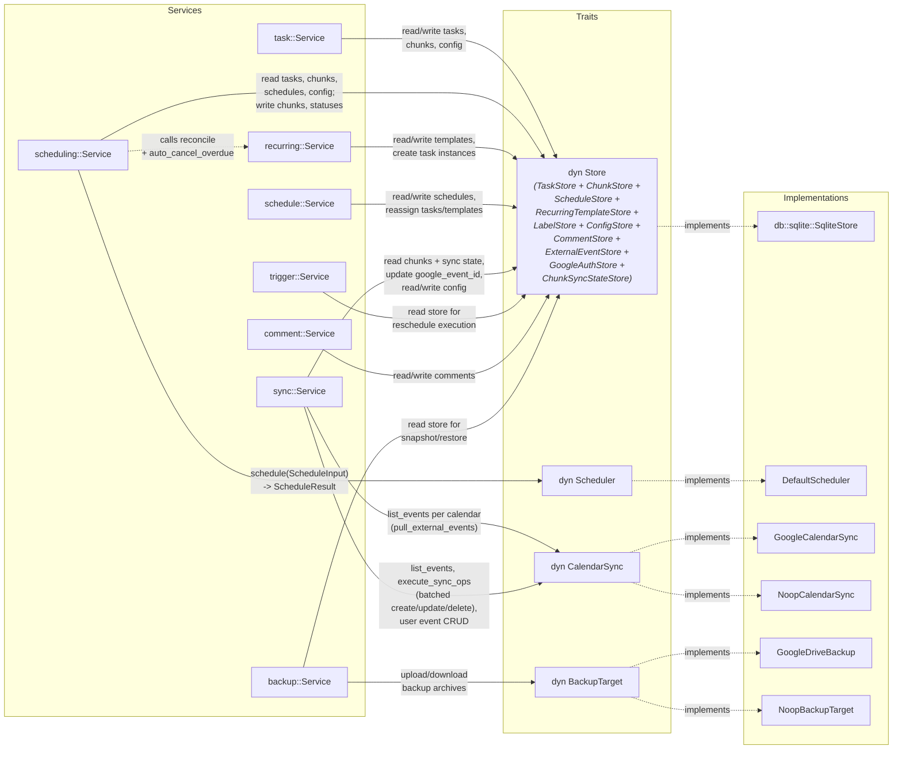
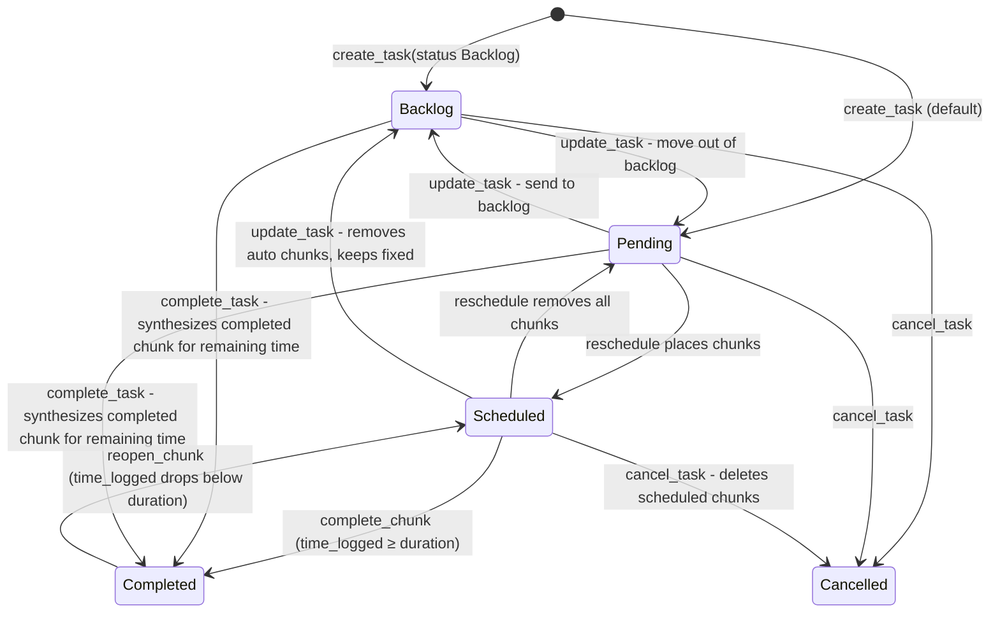
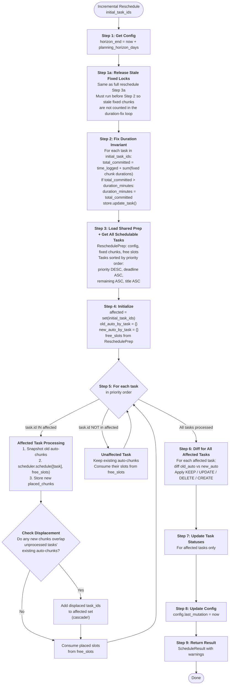
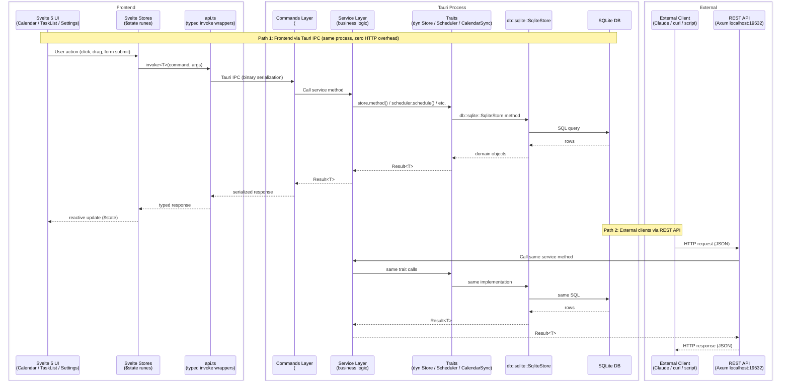
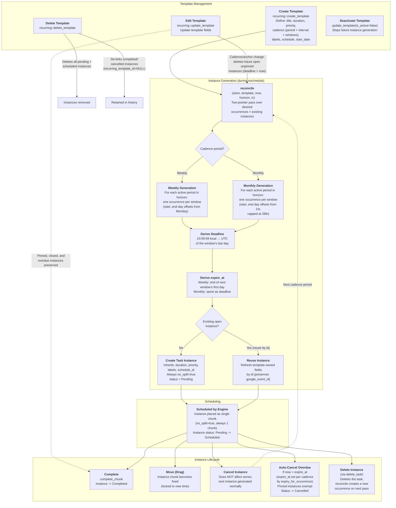

# Apreswork -- Architecture Diagrams

Mermaid diagrams capturing the full architecture of the Apreswork project.
Based on DESIGN.md, REQUIREMENTS.md, and SCHEDULER_ALGORITHM.md.

---

## 1. System Architecture (Layered)

```mermaid
graph TB
    subgraph Frontend["Frontend (Svelte 5 + TypeScript)"]
        CV[Calendar View<br/>WeekView / DayView / TimeGrid / ChunkBlock]
        TLV[Task List View<br/>TaskRow / TaskDetail / TaskForm]
        SET[Settings]
        WP[Warning Panel]
    end

    subgraph Commands["Commands Layer"]
        subgraph TauriIPC["Tauri IPC Commands"]
            TC[task_commands.rs<br/>CRUD tasks, cancel, complete,<br/>list_labels, get_agenda]
            CC[chunk_commands.rs<br/>complete, reopen, move,<br/>resize, lock, unlock,<br/>create_fixed, delete_fixed,<br/>list_external_events]
            SC[scheduler_commands.rs<br/>trigger_reschedule,<br/>trigger_reschedule_incremental]
            RC[recurring_commands.rs<br/>template CRUD]
            SchC[schedule_commands.rs<br/>schedule CRUD]
            ComC[comment_commands.rs<br/>comment CRUD]
            CfgC[config_commands.rs<br/>get/update config]
            AC[auth_commands.rs<br/>Google OAuth2 flow,<br/>calendar picker, manual pull,<br/>sync-now + status,<br/>user event CRUD]
            PC[profile_commands.rs<br/>profile gate, CRUD,<br/>switch]
            BC[backup_commands.rs<br/>status, enable, backup_now,<br/>export/import]
        end
        subgraph ExternalAPI["External Access (localhost)"]
            REST["REST API (Axum)<br/>http_server/<br/>localhost:19532"]
        end
    end

    subgraph Services["Service Layer (Business Logic)"]
        TS[task::Service<br/>Task/chunk lifecycle,<br/>create, complete, move,<br/>resize, cancel, agenda]
        SS[scheduling::Service<br/>Full reschedule,<br/>incremental reschedule,<br/>orchestration]
        RS[recurring::Service<br/>Template CRUD,<br/>instance reconciliation,<br/>auto-cancel overdue]
        ScS[schedule::Service<br/>Schedule CRUD,<br/>deletion guard,<br/>task reassignment]
        SyS[sync::Service<br/>Google Calendar sync,<br/>external-event pull,<br/>on-demand three-way push]
        TrS[trigger::Service<br/>RescheduleTrigger coordinator,<br/>policy_for trigger table,<br/>debounced + immediate dispatch]
        ComS[comment::Service<br/>Comment CRUD,<br/>system progress comments]
        BkS[backup::Service<br/>Gated export, stale-writer guard,<br/>backup-wins restore_check,<br/>staged import, archive zip]
    end

    subgraph Traits["Traits (Contracts)"]
        ST["dyn Store<br/>(TaskStore + ChunkStore +<br/>ScheduleStore + RecurringTemplateStore +<br/>LabelStore + ConfigStore +<br/>CommentStore + ExternalEventStore +<br/>GoogleAuthStore + ChunkSyncStateStore)"]
        SCH["dyn Scheduler"]
        CS["dyn CalendarSync"]
        BT["dyn BackupTarget"]
    end

    subgraph Implementations["Implementations"]
        SQL[db::sqlite::SqliteStore<br/>Mutex&lt;Connection&gt;<br/>WAL mode]
        DS[DefaultScheduler<br/>Priority-based greedy<br/>+ slot finder]
        GCS[GoogleCalendarSync<br/>OAuth2 + Calendar API v3<br/>batch sync]
        NCS[NoopCalendarSync<br/>Offline/disabled fallback]
        GDB[GoogleDriveBackup<br/>Drive file CRUD]
        NBT[NoopBackupTarget<br/>No provider configured]
    end

    subgraph Storage["Storage"]
        DB[(SQLite Database<br/>bundled via rusqlite)]
    end

    %% Frontend to Commands
    CV -->|"Tauri invoke()"| TauriIPC
    TLV -->|"Tauri invoke()"| TauriIPC
    SET -->|"Tauri invoke()"| TauriIPC
    WP -->|"Tauri invoke()"| TauriIPC

    %% External clients to REST
    ExtClient["External Clients<br/>(Claude, curl, scripts)"] -->|HTTP| REST

    %% Commands to Services
    TC --> TS
    CC --> TS
    SC --> SS
    RC --> RS
    SchC --> ScS
    ComC --> ComS
    CfgC --> ST
    AC --> CS & SyS & SS
    PC --> ST
    BC --> BT & ST
    REST --> TS & SS & RS & ScS & SyS & CS & ComS & BkS

    %% Services to Traits
    TS --> ST
    SS --> ST
    SS --> SCH
    RS --> ST
    ScS --> ST
    SyS --> ST
    SyS --> CS
    ComS --> ST
    BkS --> ST & BT

    %% Traits to Implementations
    ST -.->|implements| SQL
    SCH -.->|implements| DS
    CS -.->|implements| GCS
    CS -.->|implements| NCS
    BT -.->|implements| GDB
    BT -.->|implements| NBT

    %% Implementations to Storage
    SQL --> DB
    GCS -->|"REST API v3"| GCAL["Google Calendar API"]
    GDB -->|"REST API v3"| GDRIVE["Google Drive API"]
```



---

## 2. Module Structure (Rust Backend)

```mermaid
graph LR
    subgraph "src-tauri/src/"
        main["main.rs<br/><i>Entry point, calls run()</i>"]
        lib["lib.rs<br/><i>Composition root:<br/>Tauri builder, command registration</i>"]

        subgraph domain["domain/"]
            d_mod[mod.rs]
            d_models["models.rs<br/><i>Task, Chunk, RecurringTemplate,<br/>Schedule, ScheduleWindow, AppConfig,<br/>Comment, ChunkSyncState,<br/>ExternalEventRecord, GoogleAuthState</i>"]
            d_enums["enums.rs<br/><i>Priority, TaskStatus,<br/>ChunkStatus</i>"]
            d_cadence["cadence.rs<br/><i>Cadence struct (Period + interval + Windows),<br/>Occurrence, Window, Period</i>"]
            d_date_utils["date_utils.rs<br/><i>start_of_day, end_of_day,<br/>start_of_week, start_of_month</i>"]
            d_inputs["inputs.rs<br/><i>CreateTaskInput, UpdateTaskInput,<br/>CreateTemplateInput, UpdateTemplateInput,<br/>CreateScheduleInput, UpdateScheduleInput,<br/>CreateCommentInput, UpdateCommentInput,<br/>UpdateConfigInput, AgendaItem,<br/>TaskFilter, LabelCount</i>"]
            d_validation["validation.rs<br/><i>Input validation rules</i>"]
        end

        subgraph traits["traits/"]
            t_mod[mod.rs]
            t_storage["storage.rs<br/><i>TaskStore, ChunkStore,<br/>ScheduleStore, RecurringTemplateStore,<br/>LabelStore, ConfigStore,<br/>CommentStore, ExternalEventStore,<br/>GoogleAuthStore, ChunkSyncStateStore,<br/>Store supertrait + with_tx</i>"]
            t_scheduler["scheduling.rs<br/><i>Scheduler trait, ScheduleInput,<br/>ScheduleResult, ScheduleWarning,<br/>WarningKind, AvailableSlot,<br/>scheduling_order</i>"]
            t_calendar["calendar_sync.rs<br/><i>CalendarSync trait,<br/>AuthStatus, ExternalCalendar,<br/>ExternalEvent, RemoteChunkEvent,<br/>SyncOp, SyncOpResult,<br/>ChunkEventPayload, UserEventPayload</i>"]
            t_backup["backup.rs<br/><i>BackupTarget trait,<br/>RemoteBackupMeta</i>"]
        end

        subgraph db["db/"]
            db_mod[mod.rs]
            db_mig["migrations.rs<br/><i>Version-tracked migration runner,<br/>schema_version table</i>"]
            db_sqlite["sqlite/<br/><i>SqliteStore: all Store sub-traits,<br/>Mutex&lt;Connection&gt;, WAL mode, Store::with_tx (TxStore);<br/>per-entity modules: task, chunk, schedule,<br/>template, config_busy, sync_state, comment</i>"]
        end

        subgraph scheduler["scheduler/"]
            s_mod[mod.rs]
            s_engine["engine.rs<br/><i>DefaultScheduler:<br/>priority-based greedy placement</i>"]
            s_slot["slot_finder.rs<br/><i>expand_schedule_windows,<br/>subtract_intervals,<br/>align_slots_to_grid<br/>(DST-aware, 1-min grid)</i>"]
        end

        subgraph calendar["calendar/"]
            c_mod["mod.rs<br/><i>providers_from_config:<br/>calendar-sync + backup pair</i>"]
            c_google["google.rs<br/><i>GoogleCalendarSync:<br/>loopback PKCE flow,<br/>token refresh</i>"]
            c_http["google_http.rs<br/><i>REST list/CRUD calls,<br/>401 refresh, 403/429 backoff;<br/>batch.rs: multipart batch push<br/>(≤250/req = BATCH_MAX_OPS)</i>"]
            c_token["google_token.rs<br/><i>KeyringStore (OS keyring);<br/>refresh token persisted,<br/>access token memory-only</i>"]
            c_noop["noop.rs<br/><i>NoopCalendarSync:<br/>offline/disabled fallback</i>"]
        end

        subgraph backup["backup/"]
            b_mod[mod.rs]
            b_drive["google_drive.rs<br/><i>GoogleDriveBackup:<br/>Drive file CRUD,<br/>multipart upload</i>"]
            b_noop["noop.rs<br/><i>NoopBackupTarget:<br/>no provider configured</i>"]
        end

        subgraph services["services/"]
            sv_mod[mod.rs]
            sv_task["task/<br/><i>Task/chunk business logic:<br/>crud, chunks, lifecycle, agenda</i>"]
            sv_sched["scheduling.rs<br/><i>Full + incremental reschedule<br/>orchestration, diff_chunks,<br/>release_stale_fixed_locks</i>"]
            sv_recur["recurring/<br/><i>Template lifecycle,<br/>reconcile/ submodule:<br/>two-pointer instance reconciliation</i>"]
            sv_schedule["schedule.rs<br/><i>Schedule CRUD,<br/>deletion guard + reassignment</i>"]
            sv_sync["sync.rs<br/><i>disconnect_provider, pull_external_events,<br/>get/set_pull_calendars,<br/>sync_cycle, sync_now, get_sync_status,<br/>create/update/delete_user_event</i>"]
            sv_trigger["trigger.rs<br/><i>RescheduleTrigger coordinator,<br/>Mutation enum, policy_for table,<br/>background timer</i>"]
            sv_comment["comment.rs<br/><i>Comment CRUD (author-guarded)<br/>+ system progress comments</i>"]
            sv_backup["backup/<br/><i>gated exports + stale-writer guard,<br/>backup-wins restore_check,<br/>staged import; archive.rs:<br/>zip snapshot/verify/swap</i>"]
        end

        subgraph profiles["profiles/"]
            p_mod["mod.rs<br/><i>ProfilesState, ActiveProfile</i>"]
            p_registry["registry.rs<br/><i>profiles.json load/save (atomic),<br/>ProfileEntry, path helpers</i>"]
            p_adoption["adoption.rs<br/><i>Legacy single-profile<br/>data-dir adoption</i>"]
            p_service["service.rs<br/><i>Create, rename, delete,<br/>last-used</i>"]
            p_activate["activate.rs<br/><i>Post-unlock composition:<br/>AppState, timers, REST server;<br/>in-process profile switch<br/>(flush → activate → swap)</i>"]
        end

        subgraph commands["commands/"]
            cmd_mod[mod.rs]
            cmd_task["task_commands.rs"]
            cmd_chunk["chunk_commands.rs"]
            cmd_schedule["schedule_commands.rs"]
            cmd_scheduler["scheduler_commands.rs"]
            cmd_recurring["recurring_commands.rs"]
            cmd_comment["comment_commands.rs"]
            cmd_config["config_commands.rs"]
            cmd_auth["auth_commands.rs"]
            cmd_profile["profile_commands.rs"]
            cmd_backup["backup_commands.rs"]
        end

        subgraph api["api/"]
            api_mod[mod.rs]
            api_http["http_server/<br/><i>Axum localhost server,<br/>router + handlers + middleware</i>"]
        end

        error["error.rs<br/><i>AppError enum:<br/>NotFound, Validation, Database,<br/>CalendarSync, Backup,<br/>Internal, ProfileMismatch</i>"]
        state["state.rs<br/><i>AppState struct:<br/>Arc&lt;dyn Store&gt;,<br/>Arc&lt;dyn Scheduler&gt;,<br/>Arc&lt;RescheduleTrigger&gt;,<br/>Arc&lt;dyn CalendarSync&gt;,<br/>Arc&lt;dyn BackupTarget&gt;,<br/>profile_dir, restore_notice,<br/>ActiveProfile;<br/>ActiveState: swappable<br/>active-profile slot</i>"]
    end

    main --> lib
    lib --> state
    lib --> profiles
    lib --> commands
    lib --> api
    commands --> profiles
    commands --> services
    services --> traits
    db --> traits
    scheduler --> traits
    calendar --> traits
    backup --> traits
    services --> domain
    traits --> domain
```



---

## 3. Service Dependencies



---

## 4. Task State Machine



---

## 5. Chunk State Machine

```mermaid
stateDiagram-v2
    [*] --> Scheduled : create chunk (auto or fixed)

    Scheduled --> Completed : complete_chunk - sets logged_minutes, completed_at, records SYSTEM comment (M12.5)
    Completed --> Scheduled : reopen_chunk - subtracts logged_minutes, records SYSTEM comment (M12.5)

    state Scheduled {
        [*] --> AutoScheduled : placed by scheduler
        [*] --> Fixed : create_fixed_chunk or move or resize

        AutoScheduled --> Fixed : move_chunk or resize_chunk (sets is_fixed true)
        Fixed --> AutoScheduled : unlock_chunk (sets is_fixed false)
        Fixed --> AutoScheduled : stale-lock release (end_time < now − 4h; Steps 3a/1a)
    }

    Scheduled --> [*] : deleted by reschedule or cancel_task or template edit
```



---

## 6. Full Reschedule Flow (12-Step Pipeline)

```mermaid
flowchart TD
    START([Full Reschedule Triggered]) --> S1

    S1["<b>Step 1: Get Config</b><br/>config = store.get_config()<br/>horizon_end = now + planning_horizon_days<br/>tz = config.timezone"]
    S1 --> S2

    S2["<b>Step 2: Reconcile Recurring Instances</b><br/>For each template:<br/>reconcile(store, template, now, horizon_end, tz)<br/>Two-pointer pass: reuses existing instances by id,<br/>creates missing occurrences, deletes surplus"]
    S2 --> S3

    S3["<b>Step 3: Auto-Cancel Overdue</b><br/>Recurring instances where now > expire_at<br/>(expire_at derived per cadence by expiry_for_occurrence:<br/>weekly = end of next window's first day;<br/>monthly = deadline itself)<br/>Pinned instances exempt<br/>Set status=Cancelled, delete scheduled chunks"]
    S3 --> S3a

    S3a["<b>Step 3a: Release Stale Fixed Locks</b><br/>Fixed+Scheduled chunks with end_time < now − 4h:<br/>is_fixed = false, sync task.is_pinned<br/>(atomic: all unlocks + pinned syncs in one transaction)<br/>Allows scheduler to reclaim missed slots"]
    S3a --> S4

    S4["<b>Step 4: Load Shared Prep (ReschedulePrep)</b><br/>Re-reads config, fixed/completed chunks,<br/>schedule windows, external events, slots"]
    S4 --> S5

    S5["<b>Step 5: Get Schedulable Tasks</b><br/>status IN (Pending, Scheduled)<br/>AND time_logged < duration<br/>(remaining time > 0)"]
    S5 --> S6

    S6["<b>Step 6: Get Old Auto-Chunks</b><br/>All non-fixed, non-completed chunks<br/>(the 'old schedule' for diff)"]
    S6 --> S7

    S7["<b>Step 7: Compute Available Slots</b><br/>expand_schedule_windows(schedules, tz, now, horizon_end)<br/>For each calendar day in horizon:<br/>convert local ScheduleWindows to UTC ranges<br/>(DST-aware, each day converted independently)"]
    S7 --> S7a

    S7a["<b>Step 7a: Subtract Busy Intervals</b><br/>Read external_events mirror (busy=true only)<br/>Transparent + declined events are busy=false, never subtracted<br/>Fixed/completed chunks also treated as occupied<br/>Subtract from available_slots<br/>(prefetched by pull_external_events, no network call here)"]
    S7a --> S7b

    S7b["<b>Step 7b: Align Slots to Minute Grid</b><br/>align_slots_to_grid: starts round up, ends round down,<br/>sub-minute slots dropped<br/>All generated chunks become minute-precise"]
    S7b --> S8

    S8["<b>Step 8: Core Scheduler</b><br/>scheduler.schedule(ScheduleInput)<br/>Tasks sorted by: priority DESC, deadline ASC,<br/>remaining ASC, title ASC<br/>Greedy first-fit placement with<br/>break enforcement + schedule affinity"]
    S8 --> S9

    S9["<b>Step 9: Diff Old vs New</b><br/>Group by task_id, pair by closest start time<br/>KEEP = identical (preserves google_event_id)<br/>UPDATE = times differ (preserves google_event_id)<br/>DELETE = unpaired old<br/>CREATE = unpaired new<br/>Apply ops to database"]
    S9 --> S10

    S10["<b>Step 10: Update Task Statuses</b><br/>Pending -> Scheduled (where chunks placed)<br/>Scheduled -> Pending (no chunks remain<br/>AND no fixed chunks for that task)"]
    S10 --> S11

    S11["<b>Step 11: Update Config</b><br/>config.last_reschedule = now<br/>config.last_mutation = now<br/>store.update_config()"]
    S11 --> S12

    S12["<b>Step 12: Return Result</b><br/>ScheduleResult with placed_chunks<br/>and warnings (DeadlineViolation,<br/>Unschedulable)"]
    S12 --> END([Done])
```



---

## 7. Incremental Reschedule Flow (Cascading)



---

## 8. Data Flow



> **Not implemented** — Path 3, the chat-facing surface (REQUIREMENTS.md M10.3), has no code in the tree and its mechanism is undecided: an MCP server over the REST API, a CLI, or an in-app chat. External clients use the REST API (Path 2) today.

---

## 9. Google Calendar Sync Flow

```mermaid
sequenceDiagram
    participant Caller as Caller<br/>(Sync button, REST sync-now;<br/>there is no background sync timer)
    participant Config as AppConfig
    participant SyncSvc as sync::Service
    participant Store as dyn Store
    participant CalSync as dyn CalendarSync
    participant GCal as Google Calendar API

    Note over Caller, GCal: Two on-demand operations (the trigger timer only reschedules; it never syncs)

    rect rgb(40, 40, 60)
        Note over Caller: Chunk push sync (sync_cycle, driven by sync_now)
        Caller ->> SyncSvc: sync_now(store, calendar_sync, scheduler, trigger, now)

        SyncSvc ->> SyncSvc: pull_and_reschedule (pull mirror + full reschedule)

        SyncSvc ->> CalSync: is_available()?
        alt Not available / offline
            SyncSvc -->> Caller: Return (no-op push)
        end

        SyncSvc ->> CalSync: ensure_app_calendar(now)
        SyncSvc ->> Config: Get horizon

        SyncSvc ->> CalSync: list_app_calendar_events(now, calendar_id, now, horizon_end)
        CalSync ->> GCal: GET /calendars/{id}/events
        GCal -->> CalSync: remote chunk events
        CalSync -->> SyncSvc: Vec of RemoteChunkEvent

        SyncSvc ->> Store: get_chunks_in_range + get_chunk_sync_states_in_range
        Store -->> SyncSvc: local chunks + sync bases

        Note over SyncSvc: Three-way merge vs chunk_sync_state base.<br/>Time compares truncate to whole seconds:<br/>the provider stores second precision,<br/>so finer diffs are echo, not change.

        loop each batch of ≤ BATCH_MAX_OPS (250) SyncOps
            SyncSvc ->> CalSync: execute_sync_ops(ops)
            CalSync ->> GCal: POST /batch/calendar/v3 (multipart)
            GCal -->> CalSync: multipart response (per-op status + event IDs)
            Note over CalSync: retry throttled/5xx parts w/ backoff
            CalSync -->> SyncSvc: SyncOpResult per op
        end

        SyncSvc ->> Store: Update google_event_id + chunk_sync_state
        SyncSvc ->> Store: Record last_sync_at
    end

    rect rgb(40, 60, 40)
        Note over Caller: External event pull (Pull button, REST calendar-pull,<br/>or the first phase of sync_now)
        Caller ->> SyncSvc: pull_external_events(store, calendar_sync, now)
        SyncSvc ->> Store: get_config_value("pull_calendar_ids")
        loop each selected calendar (sequential)
            SyncSvc ->> CalSync: list_events(now, cal_id, now-7d, horizon_end)
            CalSync ->> GCal: GET /events (one selected calendar)
            GCal -->> CalSync: full event list
            CalSync -->> SyncSvc: Vec<ExternalEvent>
            SyncSvc ->> Store: replace_external_events_in_window(cal_id, ...)
        end
        Note over SyncSvc: Reschedule reads this mirror at step 7a
    end
```

---

## 10. Recurring Task Lifecycle


